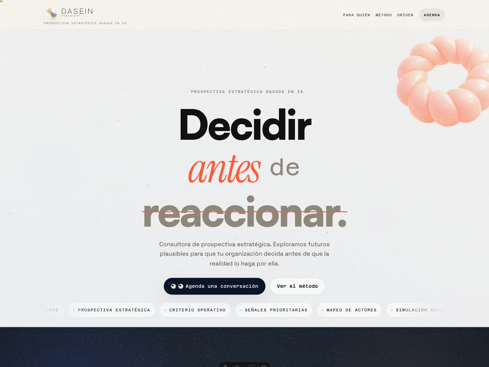
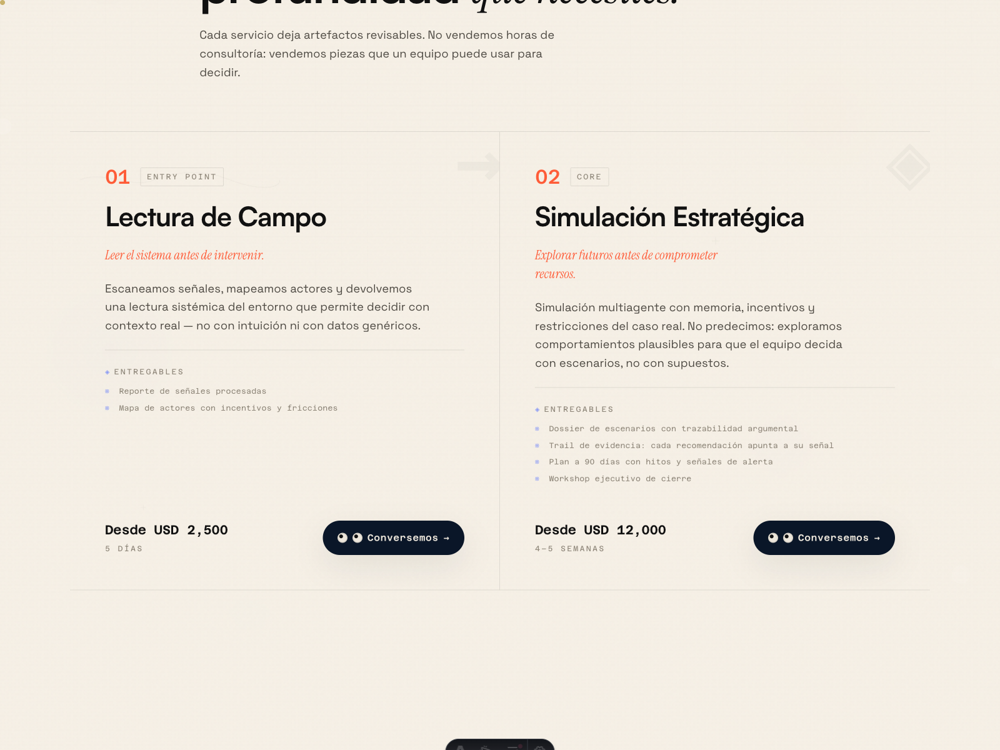
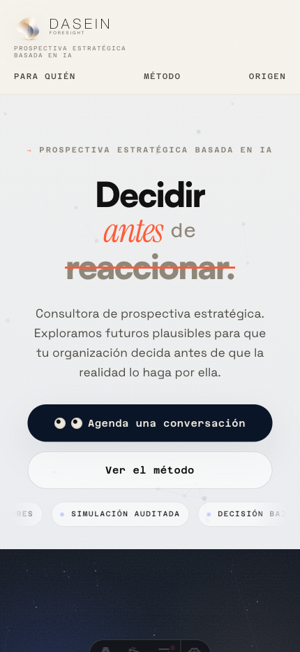

# Dasein Foresight

Public landing page for **Dasein Foresight**, an early-stage strategic foresight consultancy.

This repository is the public-facing site, not the full simulation engine. Its job is simple: explain what Dasein is, who it is for, how the offer is framed, and why the work is different from generic strategy decks or AI hype pages.

## One-sentence summary

Dasein Foresight is a Spanish-first landing page for a consulting venture that combines signal reading, actor mapping, and AI-assisted scenario simulation to help teams make better decisions under uncertainty.

## What This Project Is

This repo contains the marketing and brand site for Dasein Foresight. It is meant to:

- introduce the venture clearly
- frame the service offer without overclaiming maturity
- present the visual and narrative system behind the brand
- serve as a credible public front door for pilots, partnerships, and early client conversations

## Why It Exists

The venture is still early. That makes clarity more important than scale.

Instead of hiding behind vague language or shipping a loose collection of deck screenshots, this repo turns the current offer into a legible public artifact:

- a clear service narrative
- a visible design system
- a fast, reviewable implementation
- explicit status and limits

## Who It Is For

- founders and operators facing strategic uncertainty
- innovation, transformation, and strategy teams
- organizations exploring AI, market shifts, or policy-sensitive environments
- implementation partners who want upstream strategic framing before execution

## What Problem The Site Communicates

Dasein’s thesis is that many teams try to implement before they have properly read the system around them.

The landing page communicates a service-led answer to that problem:

- read the field through signals, actors, and frictions
- model plausible scenario behavior before committing resources
- translate complexity into a decision surface a leadership team can actually use

## What This Repo Does Not Claim

This repository does **not** publish a full public case-study library.

It does **not** expose the complete simulation backend.

It does **not** prove forecasting accuracy.

It presents the venture, the offer, and the public-facing method at the current stage of maturity.

## Current Status

**Classification:** Active product concept

What is real now:

- the landing page is built and deployable
- the venture positioning is coherent
- the service offer is defined at a public level
- the visual system is strong enough to signal seriousness

What is still early:

- public proof is limited
- case studies are not yet published on the site
- parts of the methodology remain described at narrative level rather than backed by public artifacts in this repo

See [project-status.md](./project-status.md) for a sharper breakdown.

## How It Works Technically

The site is a static Astro build with animation and visual atmosphere layered on top.

- **Astro 6** for the site shell and page composition
- **Three.js** and canvas/WebGL components for motion-heavy sections
- **GSAP** for scroll-driven choreography
- **CSS custom properties** for the token system and styling consistency
- **Vercel** and **Netlify** config files for static deployment

This is a presentation site, so the technical goal is not feature density. The goal is fast load, clear narrative sequencing, and distinct visual identity.

## Design Principles

- serious, not generic
- editorial, not startup-theater
- motion used to support reading, not distract from it
- visual confidence without pretending institutional maturity
- explicit about uncertainty, limits, and current stage

See [docs/design-principles.md](./docs/design-principles.md) and [docs/brand-guidelines.md](./docs/brand-guidelines.md).

## Methodological Limits

The landing page references a consulting method built around signals, systems, and scenario logic, but this repo should be read with the right boundaries:

- the public site explains the method; it is not the method’s full operational stack
- research support in this repo is partial, not comprehensive
- “simulation” here is part of the venture narrative and offer framing; external visitors should not treat this repo as full technical evidence of the delivery backend
- public claims should stay proportional to what can actually be inspected here

See [methodology/README.md](./methodology/README.md).

## Live Site

Intended production domain: [daseinforesight.com](https://daseinforesight.com)

## Run Locally

### Prerequisites

- Node.js `>= 22.12.0`

### Install

```bash
npm install
```

### Start the dev server

```bash
npm run dev
```

### Build for production

```bash
npm run build
```

### Preview the production build

```bash
npm run preview
```

## Environment Variables

No environment variables are required for the current site build.

A minimal [`.env.example`](./.env.example) is included so deployment metadata can be added later without guesswork.

## Repository Structure

```text
src/            Astro pages, components, styles, and visual logic
public/         Static assets: brand marks, founder image, media, favicons
docs/           Public-facing notes on design and repository context
methodology/    Method framing and limits behind the site narrative
screenshots/    Repository screenshots and capture checklist
project-status.md
roadmap.md
```

## Screenshots

Screenshot guidance and file expectations live in [screenshots/README.md](./screenshots/README.md).

Current captures:







## License

See [LICENSE](./LICENSE).

The short version:

- source code is MIT-licensed unless noted otherwise
- brand assets, logos, photography, and marketing copy remain restricted

## Public Readability Audit

This pass improves the repo, but two things still weaken it as a pinned artifact:

- older internal workflow material is still tracked in the repo root and auxiliary folders
- public proof is lighter than the quality of the visual execution

Those are solvable, but they are separate from the core site itself.
